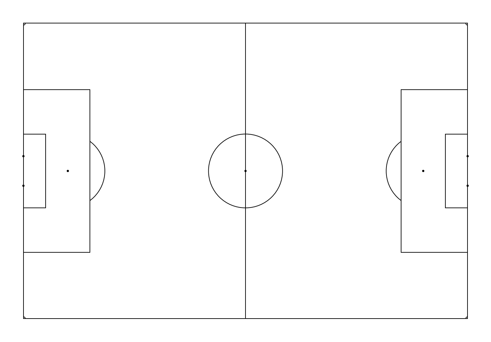
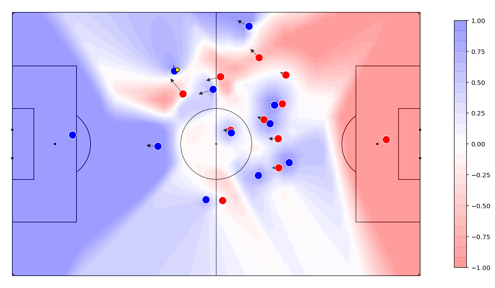
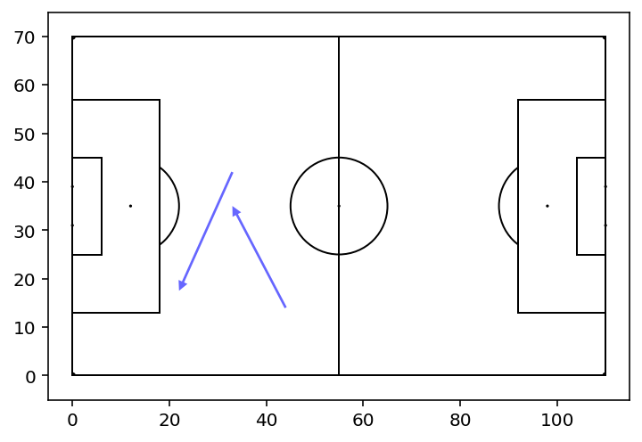
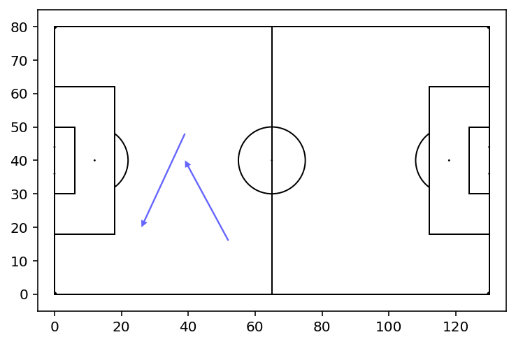
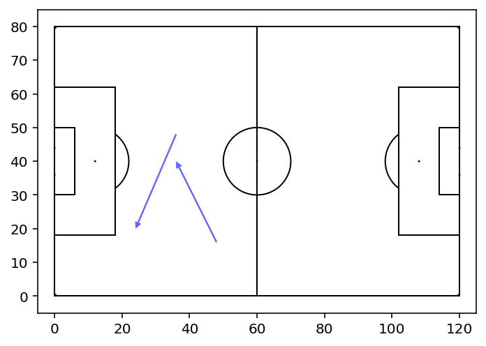
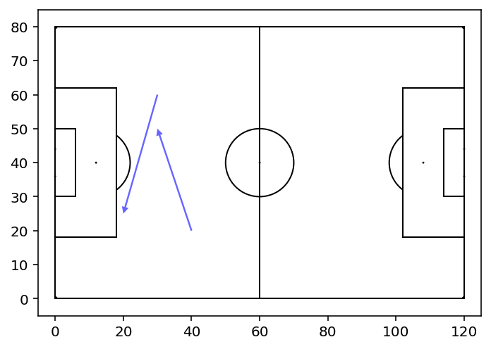

# NorthPitch

NorthPitch is a python soccer plotting library that sits on top of Matplotlib.

### Install:

```
pip install git+https://github.com/devinpleuler/northpitch.git
```

### Basic Example:
```python
from northpitch.pitch import Pitch

fig, ax = plt.subplots(figsize=(15,9))
ax.set_axis_off()

pitch = Pitch()
pitch.create_pitch(ax)

plt.ylim(pitch.ylim)
plt.xlim(pitch.xlim)

plt.show()
```



### Surface Example:

```python
from northpitch.pitch import draw_tracking_frame
from northpitch.pitch import overlay_surface

frame = tracking_frames[n]
surface = pitch_control_function(frame)

fig, ax = draw(frame, deltas=True, title="NorthPlotter example")
contours = overlay_surface(ax, surface)

plt.colorbar(contours, ax=ax)
plt.show()
```
> Note: Provide your own list of tracking frames, and pitch control function. Sorry.




### Field Size Examples

```python
import matplotlib.pyplot as plt
from northpitch.pitch import Pitch

fig, ax = plt.subplots()
pitch = Pitch(length=110, width=70) # FIFA Minimum
pitch.create_pitch(ax)
passes = [(30,60, 20,25), (40,20, 30,50)]
pitch.draw_lines(ax, passes)
plt.ylim(pitch.ylim)
plt.xlim(pitch.xlim)
plt.show()
```


```python
import matplotlib.pyplot as plt
from northpitch.pitch import Pitch

fig, ax = plt.subplots()
pitch = Pitch(length=130, width=80) # FIFA Maximum
pitch.create_pitch(ax)
passes = [(30,60, 20,25), (40,20, 30,50)]
pitch.draw_lines(ax, passes)
plt.ylim(pitch.ylim)
plt.xlim(pitch.xlim)
plt.show()
```


### Scale Examples

```python
import matplotlib.pyplot as plt
from northpitch.pitch import Pitch

fig, ax = plt.subplots()
pitch = Pitch(scale=(100, 100)) # Default (Opta)
pitch.create_pitch(ax)
passes = [(50,50, 60,40)]
pitch.draw_lines(ax, passes)
plt.ylim(pitch.ylim)
plt.xlim(pitch.xlim)
plt.show()
```


```python
import matplotlib.pyplot as plt
from northpitch.pitch import Pitch

fig, ax = plt.subplots()
pitch = Pitch(scale=(120, 80)) # (StatsBomb)
pitch.create_pitch(ax)
passes = [(50,50, 60,40)]
pitch.draw_lines(ax, passes)
plt.ylim(pitch.ylim)
plt.xlim(pitch.xlim)
plt.show()
```

